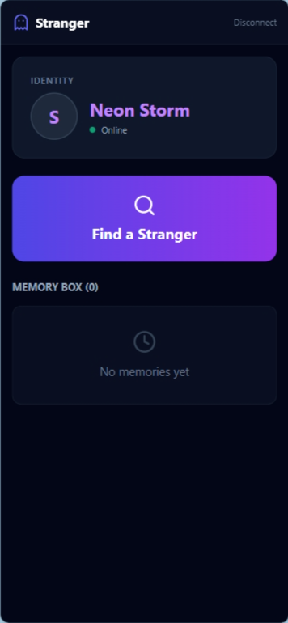
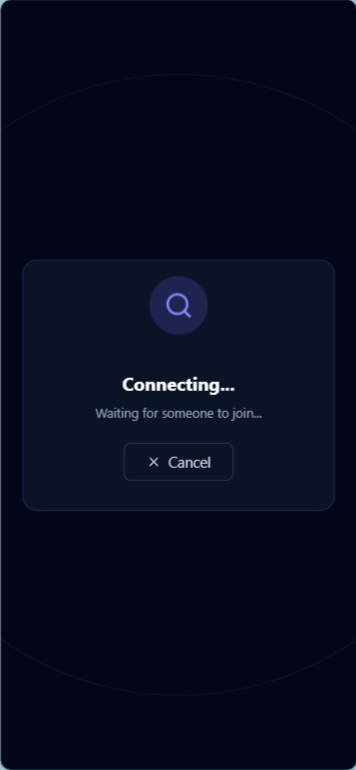

 
 

<!-- MAIN TITLE & LOGO -->

👻

<h1>Stranger App</h1>

<strong>Connect Deeply. Remain a Mystery.</strong>

A real-time anonymous chat application built for instant global connections without data tracking.

<!-- BADGES -->

  
  
  
  

 
 
<h2 align="center">📸 App Interface</h2>

  <!-- Desktop Interfaces -->
  
  
    
  
  

    

  <!-- Mobile Interfaces -->
  

    
    &nbsp;&nbsp;&nbsp;&nbsp;
    
  

📋 Table of Contents

✨ Features

🛠️ Tech Stack

🚀 Quick Start

📱 Mobile Testing

🔒 Security

✨ Features

Feature

Description

🎭 Total Anonymity

Uses Firebase Anonymous Auth. No names, emails, or logs are ever stored.

⚡ Real-Time Matching

Custom "Waiting Pool" algorithm connects users instantly (FIFO).

🔒 Isolated Rooms

Chat history is stored in unique, secure sub-collections for maximum privacy.

🆔 Auto-Identities

Users get temporary session personas like Neon Fox or Misty Owl.

📱 Fully Responsive

Optimized for all devices using Tailwind CSS mobile-first classes.

🛠️ Tech Stack

Frontend: React (Vite)

Styling: Tailwind CSS

Icons: Lucide React

Backend: Firebase (Firestore & Auth)

🚀 Quick Start

Follow these steps to run the project locally.

1. Clone & Install

# Clone the repository
git clone [https://github.com/naqvi10k/stranger-app.git](https://github.com/naqvi110k/stranger-app.git)

# Go into the app folder
cd stranger-app

# Install dependencies
npm install

2. Configure Firebase (Crucial)

This app requires a backend to work. Create a free project at console.firebase.google.com.

Enable Authentication: Go to Authentication > Sign-in method > Enable Anonymous.

Enable Database: Go to Firestore Database > Create Database > Start in Test Mode.

Get Config: Go to Project Settings > General > Your Apps > SDK Setup.

Copy your config keys into src/App.jsx:

const firebaseConfig = {
  apiKey: "YOUR_REAL_API_KEY_HERE",
  authDomain: "your-project.firebaseapp.com",
  projectId: "your-project",
  storageBucket: "your-project.appspot.com",
  messagingSenderId: "123456789",
  appId: "1:123456789:web:abcdef"
};

3. Run the App

npm run dev

📱 Mobile Testing

To test the chat between your computer and phone on the same Wi-Fi:

Run the host command:

npm run dev -- --host

Check your terminal for the Network URL (e.g., http://192.168.1.5:5173).

Enter that URL in your phone's browser.

🔒 Security

For production, protect your data by adding these rules in the Firebase Console > Firestore > Rules:

rules_version = '2';
service cloud.firestore {
  match /databases/{database}/documents {
    // Only allow signed-in users (even anonymous ones) to read/write
    match /artifacts/stranger-app-v2/{document=**} {
      allow read, write: if request.auth != null;
    }
  }
}

 

Made with ❤️ by <strong>You</strong>

